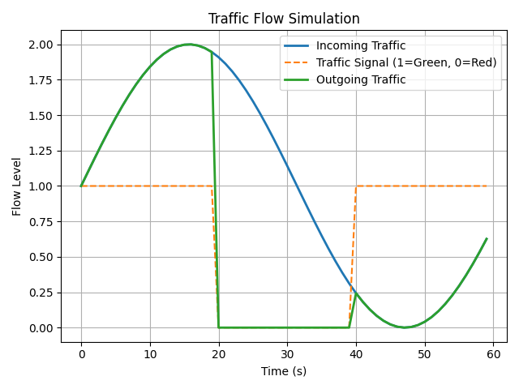
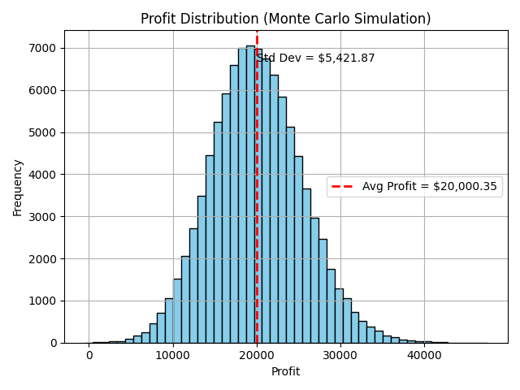
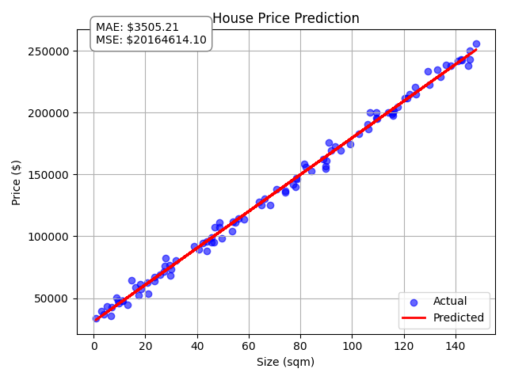

# Laboratory Activity # 2: Real-World Applications of Simulation, Random Sampling, and Model Validation

## Running the program

Follow these steps to execute the program:

1. **Make the code executable then run the program**:
  ```bash
  chmod +x run.sh
  ```
  ```bash
  ./run.sh
  ```

## Output
**Part_1.py**
<div align="center">
  
</div>

**Part_2.py**
  ```bash
  Tellers: 2
  Average Wait Time: 0.53 minutes
  Total Customers Served: 15
  ```

**Part_3.py**
<div align="center">
  
</div>

**Part_4.py**
<div align="center">
  
</div>

