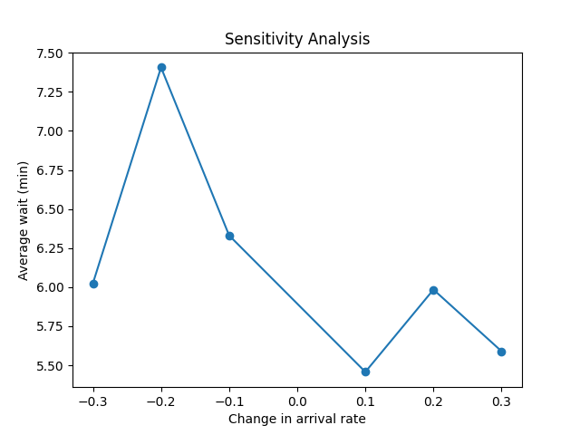

# Laboratory Activity # 7: Hospital Emergency Department Resource Allocation

## Running the program

Follow these steps to execute the program:

1. **Make the code executable then run the program**:
  ```bash
  chmod +x run.sh
  ```
  ```bash
  ./run.sh
  ```

## Output

<div align="center">
  
</div>

```bash
    nurses  doctors  cost    avg_wait
0        1        1   960  100.291161
1        1        2  1560   59.217044
2        1        3  2160  133.709047
3        1        4  2760   73.466982
4        1        5  3360  107.523054
5        2        1  1320  182.687199
6        2        2  1920   11.260443
7        2        3  2520   13.451211
8        2        4  3120    7.826942
9        2        5  3720    9.822876
10       3        1  1680  214.905544
11       3        2  2280   10.748237
12       3        3  2880    6.494221
13       3        4  3480    8.644199
14       3        5  4080    6.030201
15       4        1  2040  100.949971
16       4        2  2640   16.883034
17       4        3  3240    7.444048
18       4        4  3840    5.989946
19       4        5  4440    5.859678
20       5        1  2400  164.647824
21       5        2  3000   12.778861
22       5        3  3600    8.231670
23       5        4  4200    6.155961
24       5        5  4800    6.476633
```


